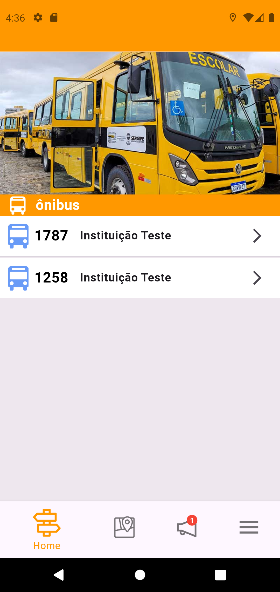
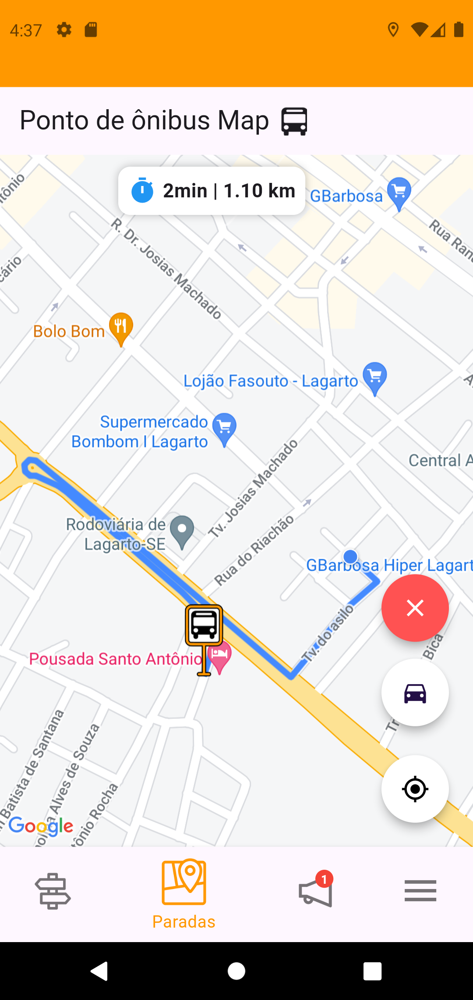

# 🚍 **Meu Ônibus - Aplicativo de Transporte Estudantil**

Bem-vindo ao **Meu Ônibus**, um aplicativo desenvolvido para facilitar o acesso dos estudantes às informações sobre o transporte estudantil. Com uma interface intuitiva e integração com o **Google Maps**, os usuários podem visualizar ônibus disponíveis, horários, pontos de parada e receber avisos importantes.

## 🔹 **Principais Recursos**

✅ Lista de ônibus disponíveis e seus horários  
📍 Visualização de pontos de parada com fotos e referências  
🗺️ **Integração com Google Maps** para exibição de rotas e localização dos pontos  
🔔 Notificações da empresa e mensagens do motorista  
🎯 Interface intuitiva e responsiva 

---

## 🛠 **Tecnologias Utilizadas**

### 📱 **Frontend (Flutter)**
O aplicativo foi desenvolvido utilizando **Flutter**, garantindo compatibilidade com dispositivos Android e iOS.

- **Flutter (Dart)** - Framework principal  
- **Http** - Comunicação com o backend  
- **Provider** - Gerenciamento de estado  
- **Google Maps API** - Exibição dos pontos e rotas  


### 🖥️ **Backend (Java + Spring Boot)**
A API foi construída com **Java e Spring Boot**, garantindo segurança e eficiência na comunicação entre o app e o banco de dados.

- **Java 17** - Linguagem de programação  
- **Spring Boot** - Framework para API REST  
- **Spring Security + JWT** - Autenticação segura com tokens  
- **Flyway** - Gerenciamento de versões do banco de dados  
- **PostgreSQL** - Banco de dados relacional  
- **Swagger** - Documentação interativa da API  

---

# Meu Aplicativo 🚍  
Este é um aplicativo para transporte público estudantil.  

## 📱 Capturas de Tela  
### Tela Inicial  


### Tela de Rotas  


## 🚀 **Como Executar o Projeto**

### **Frontend (Flutter)**
1. Clone o repositório:  
   ```sh
   git clone https://github.com/DevLuizEduardo/MeuOnibus-FrontEnd.git
   ```
2. Instale as dependências:  
   ```sh
   flutter pub get
   ```
3. Configure a chave da API do Google Maps no arquivo `AndroidManifest.xml`.  
4. Execute o projeto:  
   ```sh
   flutter run
   ```

### **Backend (Spring Boot + Java)**
1. Clone o repositório:  
   ```sh
   git clone https://github.com/DevLuizEduardo/MeuOnibus.git
   ```
2. Configure o banco de dados no arquivo `application.properties` ou `application.yml`.  
3. Execute o projeto com Maven ou diretamente pelo Spring Boot:  
   ```sh
   mvn spring-boot:run
   ```
   Ou:  
   ```sh
   ./mvnw spring-boot:run
   ```

---


🚀 **Desenvolvido por [Luiz Eduardo]**

